## Início
Sejam  todos muito bem vindos!
Aqui vamos aprender como estilizar algumas ferramentas.

## PowerShell
Abaixo iremos estilizar o PowerShell com o ["Oh My Posh"](https://ohmyposh.dev)

### Instalação
- Abra seu PowerShel;
- Instale o programa colocando na linha de comando:
```bash
winget install JanDeDobbeleer.OhMyPosh -s winget 
```
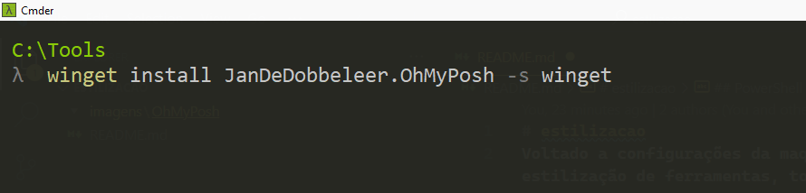

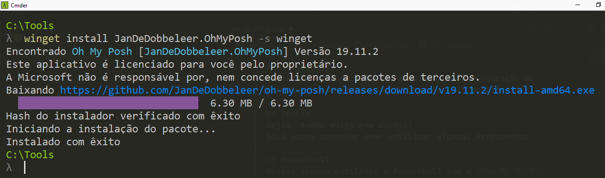

- Após instalado, feche seu PowerShell e abra como administrador.

### Instalação de fontes
Instalação de fontes advindas do ["Nerd Fonts"](https://www.nerdfonts.com/) pois as mesmas são compatíveis com o programa.

Alternativas:

1 - Podemos acessar a página, fazer o download das fontes;

2 - Utilizar o comando do Oh My Posh para baixar e instalar a fonte desejada;

Utilizaremos a opção 2, no prompt de comando digite:
```bash
oh-my-posh font install --user
```
Sera apresentado um menu com o nome das fontes. 

Escolha a fonte desejada usando as setas do teclado, conforme visualizadas no site Nerd fonts.
Eu escolhi a Hack!

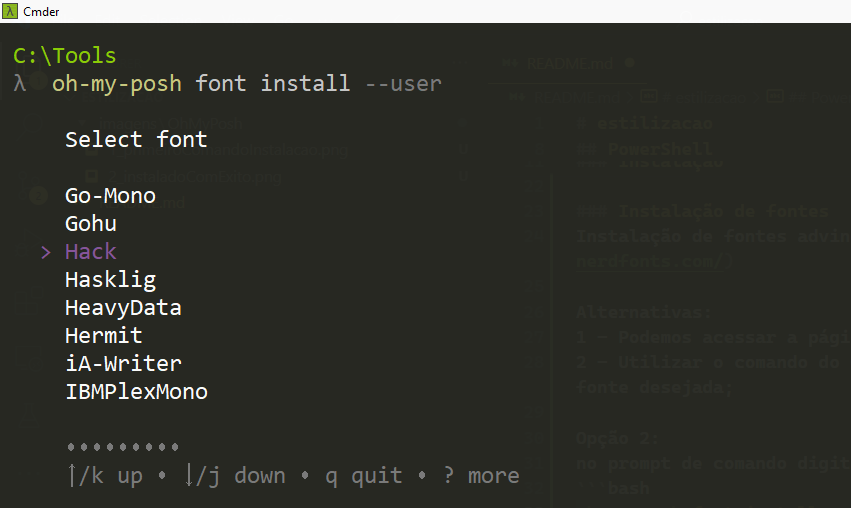

Após instalado, feche seu PowerShell e abra como administrador.

### Configurações do terminal Powershell
Para melhor acesso as configurações do terminal, na plataforma da Microsoft Store, instale o "Windows Terminal"

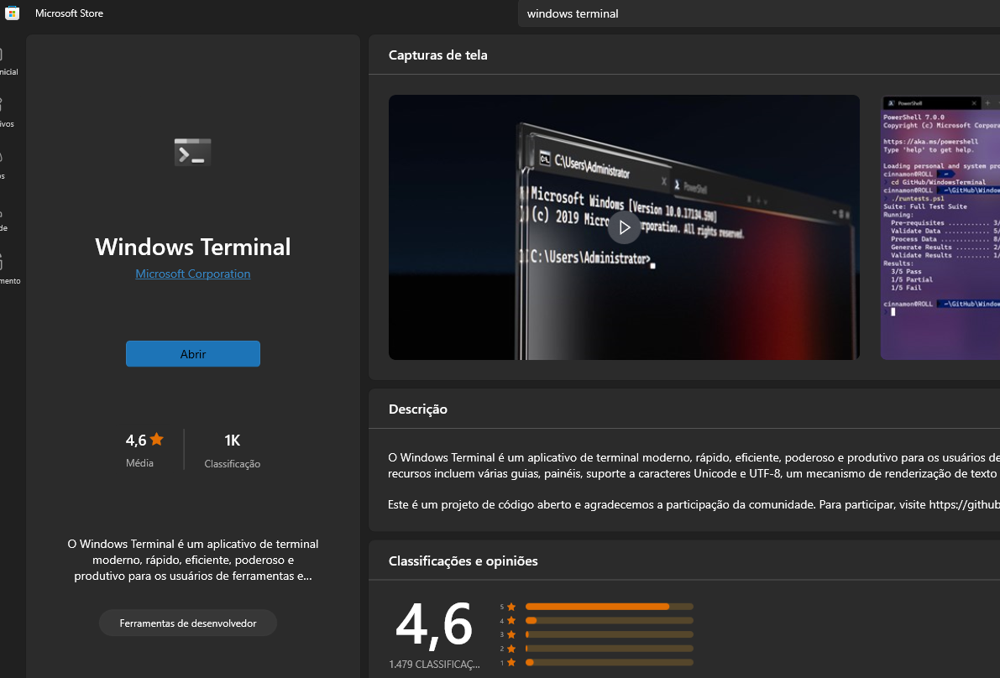

Vá em configurações > Powershell > Aparência > Tipo de fonte escolha "Hack Nerd Font" e clique em "Salvar".

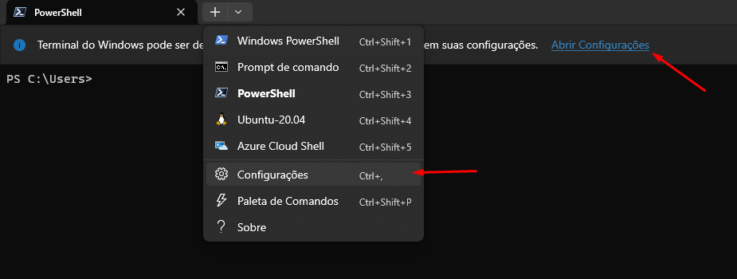

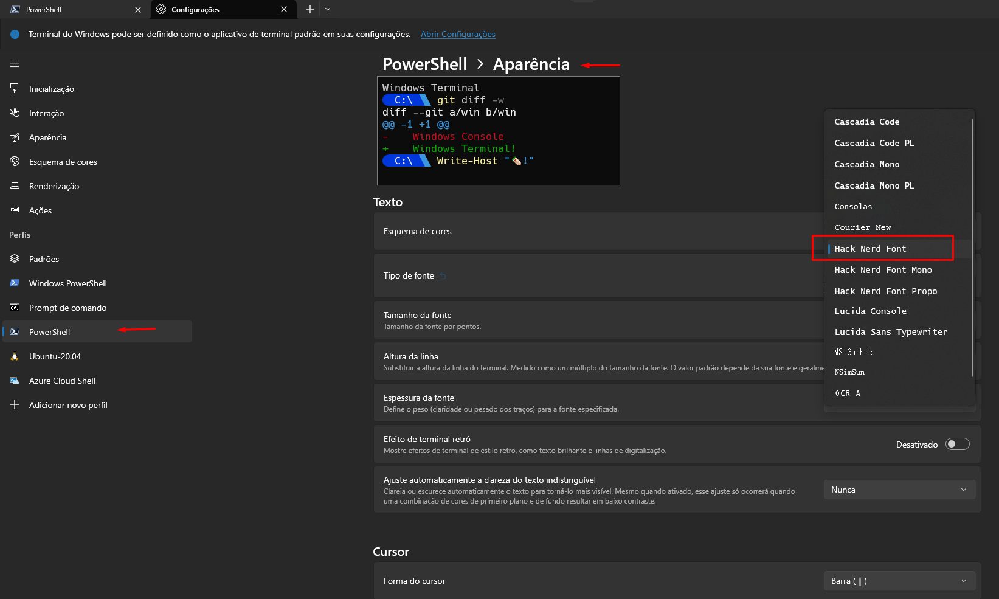

Adotando o prompt do powerShell para o oh my posh, use o comando:
```bash
oh-my-posh get shell
```
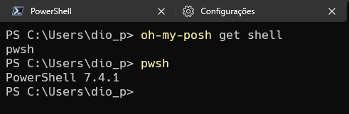

### Configurações do terminal Cmder
Outra opção de terminal é usar o ["Cmder"](https://cmder.app)
Abra o Cmder;
No canto inferior direito, clique na seta para baixo localizado ao lado do botão "+", em seguida "Setup Tasks";

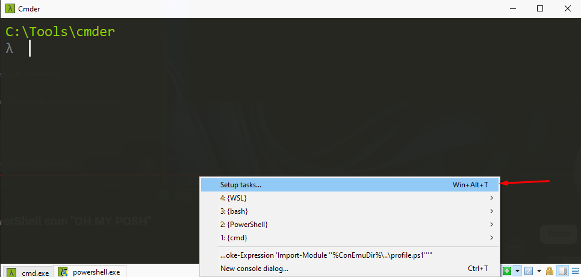

Escolha a fonte que adotada -> Hack Nerd Font;

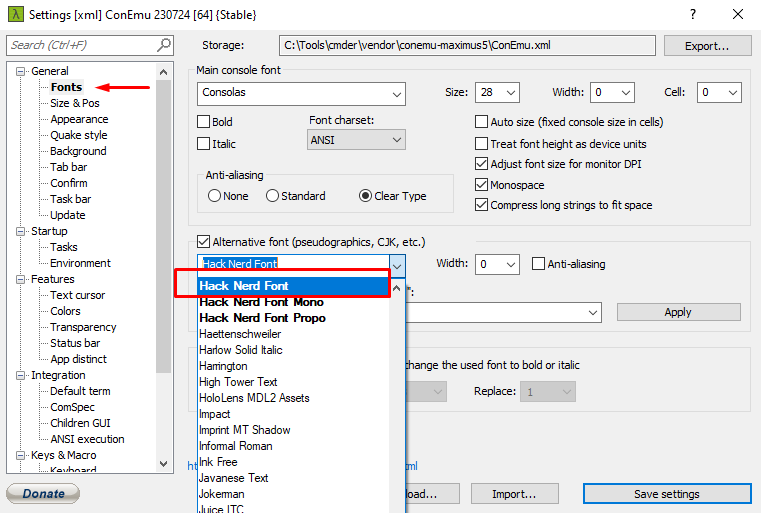

Adotando o prompt do powerShell para o oh my posh, use o comando:
```bash
oh-my-posh get shell
```
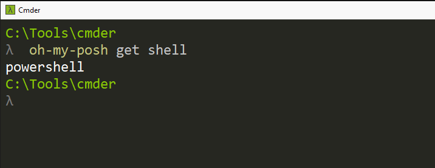

### Perfil de configurações PowerShell
É necessário ter um arquivo de configurações Powershell para chamada do "Oh My Posh", se o mesmo ja existe, voce poderá acessar pedindo para que seja executado no próprio bloco de notas usando o comando abaixo:
```bash
notepad $PROFILE
```
Caso o mesmo ainda não exista, aparecerá um erro, conforme apresento abaixo:
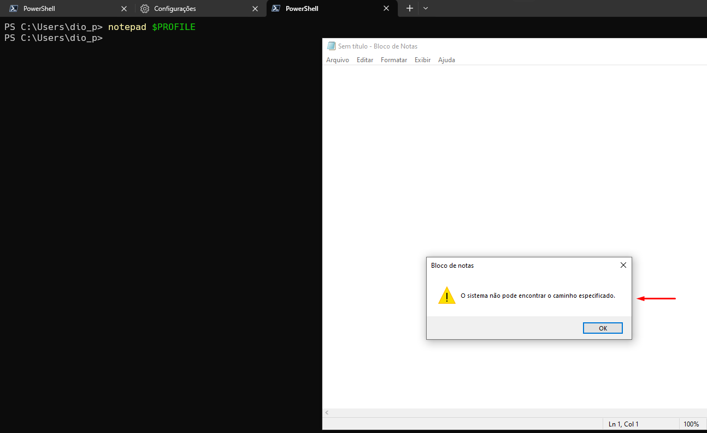

Neste caso, vamos criar o arquivo utilizando o comando:
```bash
New-Item -Path $PROFILE -Type File -Force
```
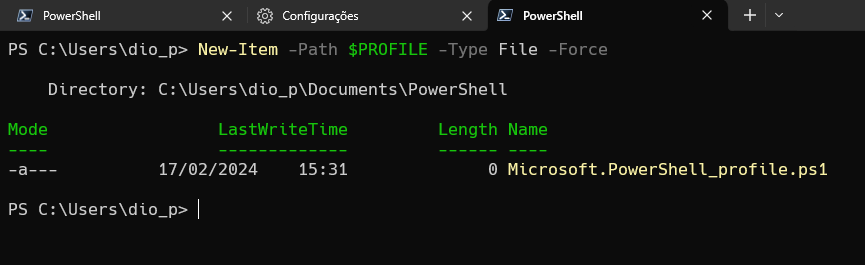

### Permissão de scripts locais no PowerShell
Há possibilidade de que o Poweshell bloqueie a execução de scripts locais.
Para que seja chamada as configurações do Oh my Posh corretamente, deverá ser permitido que scripts locais sejam executados. Mais a frente veremos que o aplicativo é dinâmico e pega status correntes, como do git, dessa forma, é necessário a permissão adequada.
Usando o comando voce concede permissão apenas para script locais, nos quais os remotos são assinados.
Utilize o comando:
```bash
Set-ExecutionPolicy RemoteSigned
```
Caso ocorra erro na execução, conforme apresento imagem abaixo, feche o Poweshell e execute como administrador.

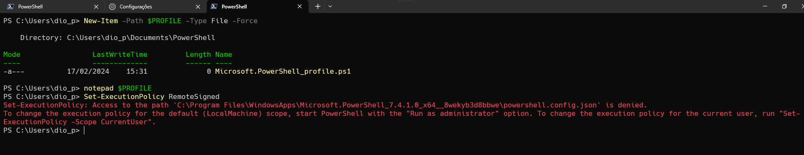

Caso ainda ocorra o erro, utilize a parametrização manual, digite o comando abaixo, em seguida "RemoteSigned":
```bash
Set-ExecutionPolicy -Scope CurrentUser
```
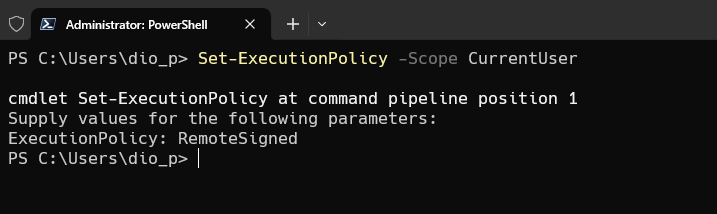

outras forma para permissões
```bash
Set-ExecutionPolicy RemoteSigned -Scope CurrentUser
```

Para confirmar que a politica foi realmente ajustada, utilize o comando para consulta:

```bash
Get-ExecutionPolicy -List
```
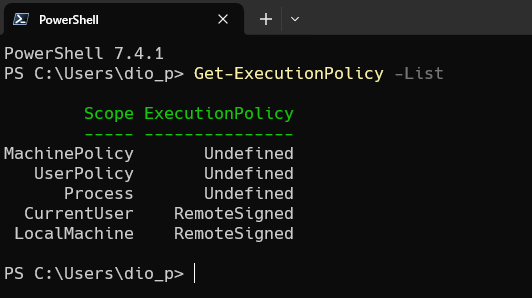

### Abrindo arquivo PROFILE
Abra o arquivo de configuração PROFILE, através do comando abaixo:
```bash
notepad $PROFILE
```
Adicione no arquivo o comando a seguir:
```bash
oh-my-posh init pwsh | Invoke-Expression
```
Salve os dados do arquivo;
Atualize os dados do arquivo PROFILE usando o comando:
```bash
. $PROFILE
```
Observe que agora as configurações estão em uso, com um exemplo básico.
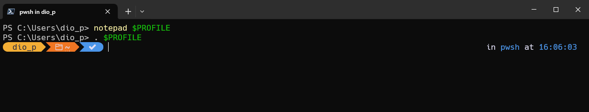

Voce pode consultar um tela na pagina do ["Oh My Posh"](https://ohmyposh.dev/docs/themes) ou ja pode ver um exemplo no seu próprio terminal com os exemplos. Execute o comando abaixo:
```bash
Get-PoshThemes
```
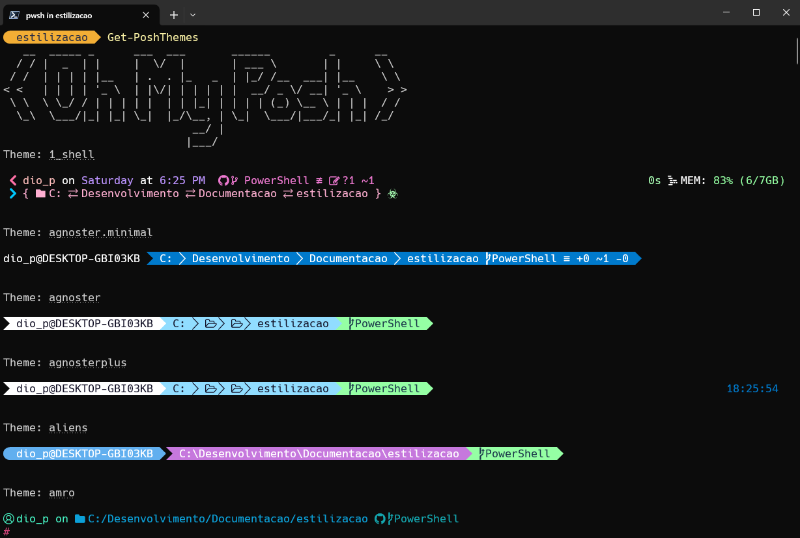
Isto acontece porque todos os temas ja estão na sua maquina! 

Observe que no final da execução do comando ele também apresenta a localizaçào dos temas na sua maquina e um exemplo de como mudar para outro tema. 

No exemplo abaixo o modelo chama-se "jandedobbeleer.omp.json".

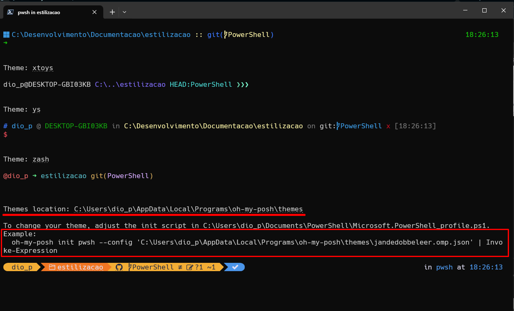

### Alterando Tema
- Copie o caminho do exemplo apresentado acima;
- Abra o arquivo $PROFILE;
```bash
notepad $PROFILE
```
- Subistitua o código anterior do arquivo pelo exemplo, lembrando de alterar pelo seu modelo favorito;

A partir de agora, não precisa mais abrir o powershell como administrador!


## Conteúdos complementares
[Personalisando o Powershell](https://www.youtube.com/watch?v=yLg5k0BT2tc)

### Terminando instalação powershell

Abra configurações do powershell > Abrir arquivo json; (usei o VSCode)

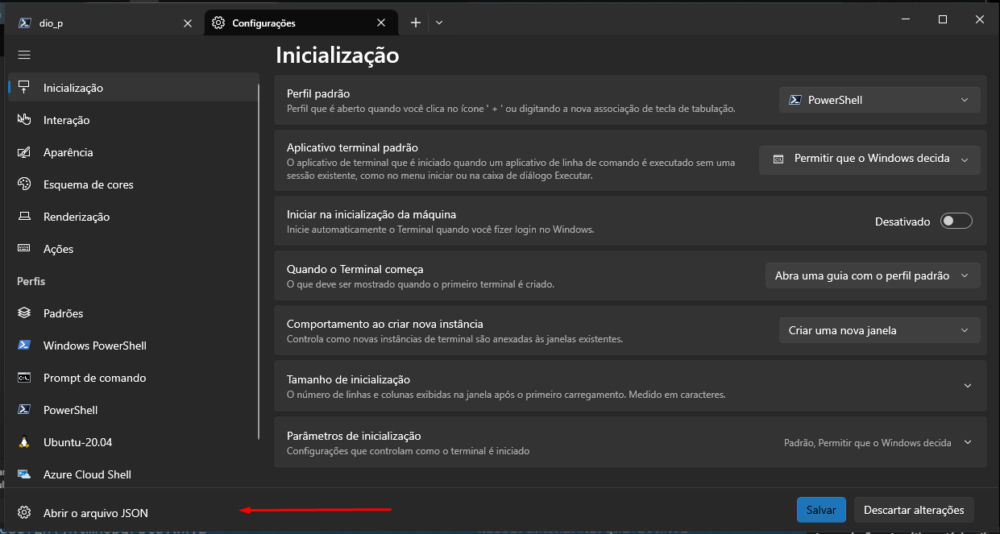

Adicione o trecho de código como mostra abaixo:
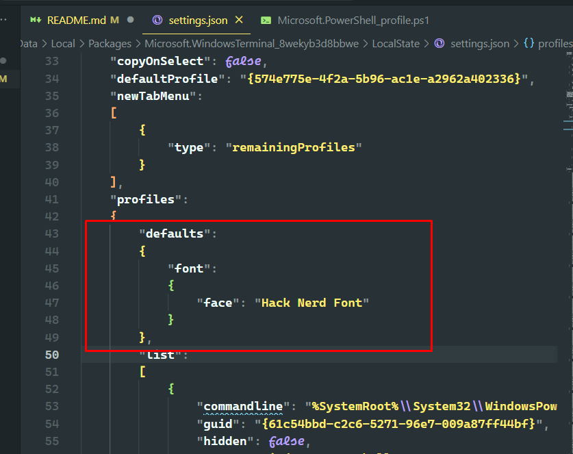

ou, vá em configurações padrões, em Powershel:
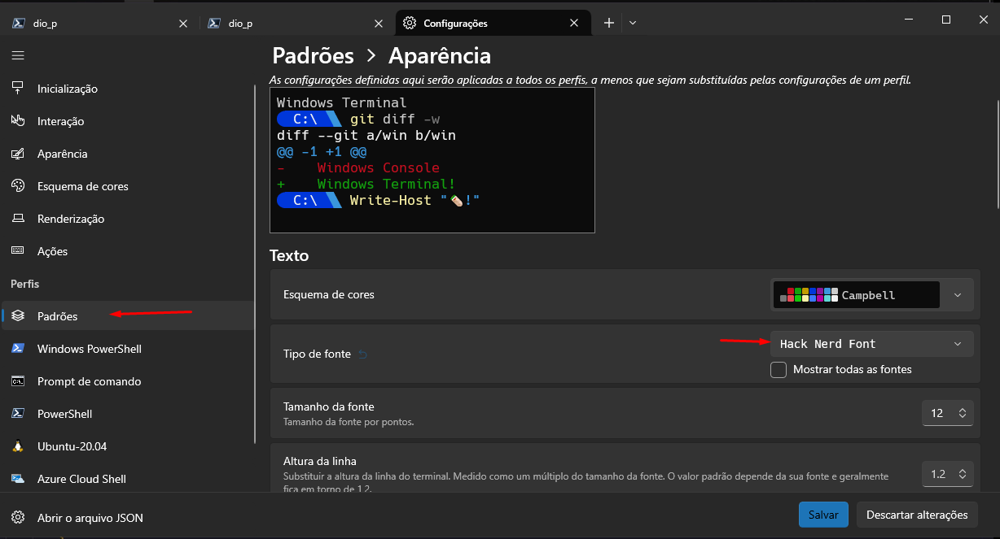

executando terminal do VSCode como adm
```bash
Start-Process code -ArgumentList " . " -Verb RunAs
```

Se seu terminal ainda apresenta quebra na exibição dos símbolos;
Adicione no arquivo .json do VS Code:

```bash
"terminal.integrated.fontFamily": "Hack Nerd Font"
```
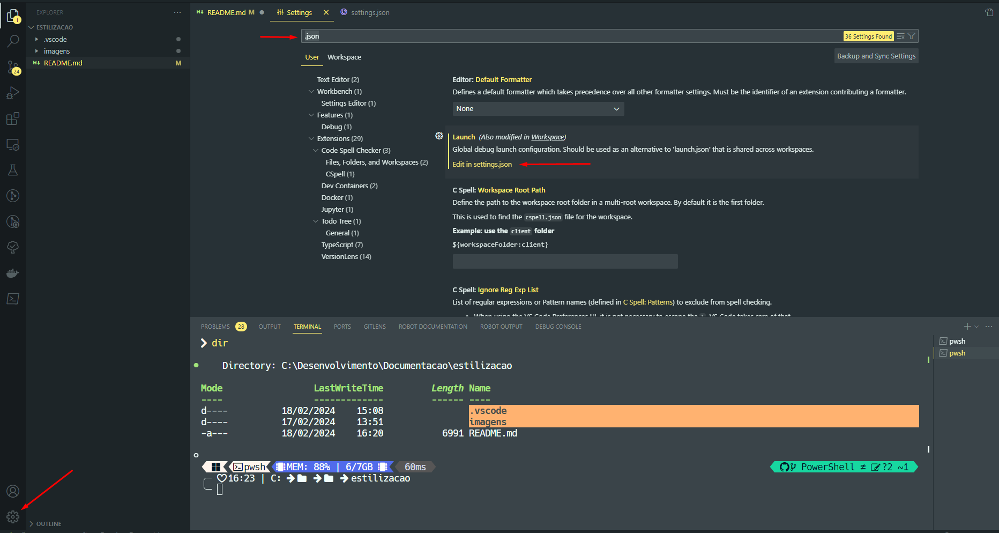

[Vídeo](https://www.youtube.com/watch?v=-6YVarfmw48)

Alterar a fonte do terminal
```bash
"terminal.integrated.fontSize": 18,
```  
Espero que tenha ajudado! \o/